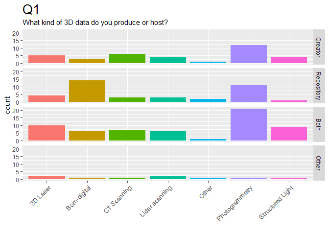
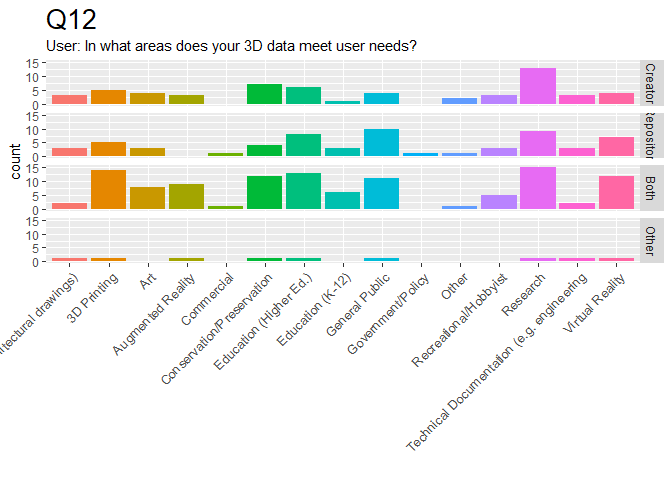
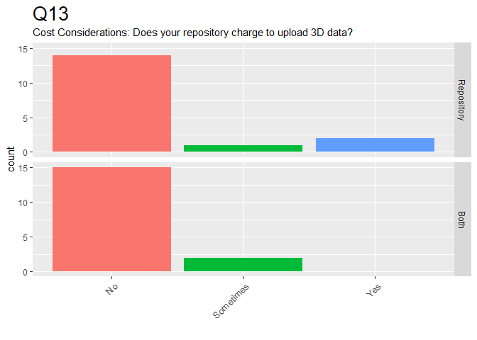
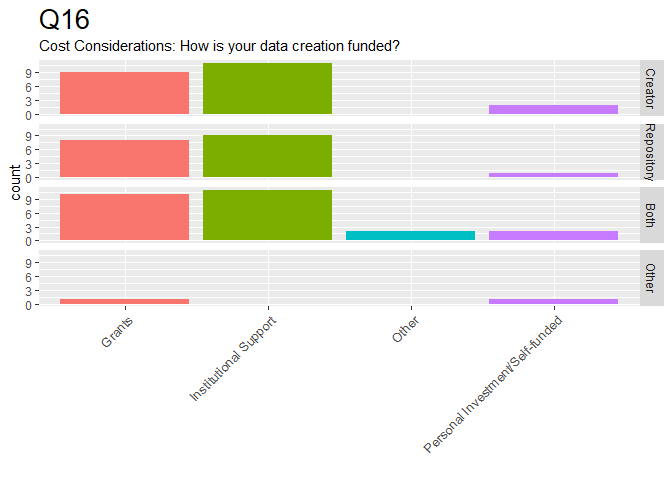
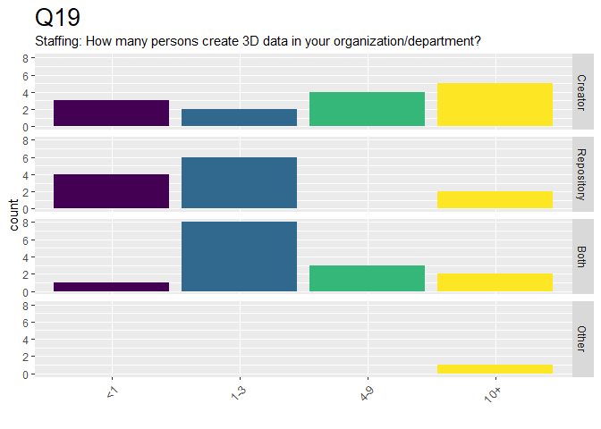
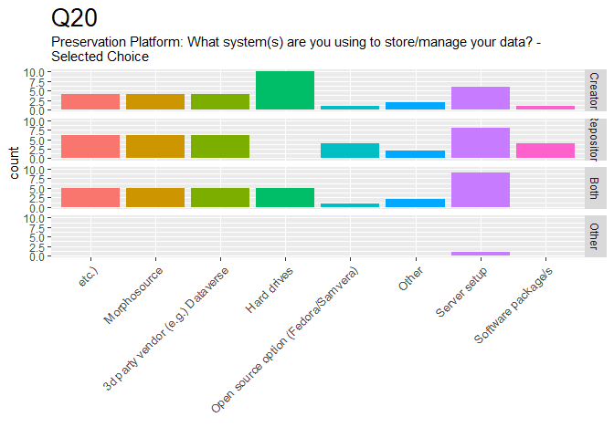
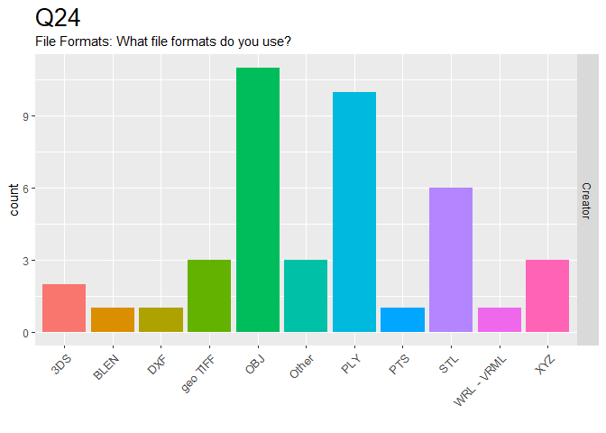

CS3DP Management Survey
================

Summary of Results
------------------

These are quick summaries of the initial results to the CS3DP Data Management survey.

1.  Raw response data is in the [CS3DP Management group folder](https://drive.google.com/drive/u/0/folders/1fc-wqiG6J3lPyPC7WoWyV0GP1bJ6A2BQ)
2.  Intermediate step: Made sure column headers & values were aligned
3.  Data is prepped and this doc is generated by [this RMarkdown script](https://github.com/magpiedin/CS3DP-management-survey/blob/master/CS3DP_mgmt.Rmd)

-   [Tables](#Tables)
-   [Charts](#Charts)

Tables
------

### Q1

-   What kind of 3D data do you produce or host? \*

| Group      | 3D Laser | Born-digital | CT Scanning | Lidar scanning | Other | Photogrammetry | Structured Light |
|:-----------|:---------|:-------------|:------------|:---------------|:------|:---------------|:-----------------|
| Creator    | 5        | 3            | 6           | 4              | 1     | 12             | 4                |
| Repository | 4        | 13           | 2           | 3              | 2     | 9              | 1                |
| Both       | 10       | 6            | 7           | 6              | 1     | 21             | 9                |
| Other      | 2        | 1            | 1           | 2              | 1     | 1              | 1                |

### Q4

-   Repository Institution Type: What type of institution houses/maintains the repository? \*

| Group      | 4   | Archive/Library | Commercial organization | Governmental organization | Museum | Non-profit | Other | University department/center |
|:-----------|:----|:----------------|:------------------------|:--------------------------|:-------|:-----------|:------|:-----------------------------|
| Repository | 2   | 13              | 1                       |                           | 5      | 2          |       | 4                            |
| Both       | 1   | 10              | 1                       | 1                         | 7      | 1          | 1     | 11                           |

### Q6

-   Repository Information: In what year did you or your institution begin creating, managing, and/or archiving 3D data? \*

| Group      | Before 1990 | 1990-1994 | 1995-1999 | 2000-2004 | 2005-2009 | 2010-2014 | 2015-2019 |
|:-----------|:------------|:----------|:----------|:----------|:----------|:----------|:----------|
| Creator    |             |           |           |           | 2         | 4         | 10        |
| Repository | 1           | 1         |           | 1         | 1         | 4         | 6         |
| Both       |             | 1         | 1         | 2         | 1         | 4         | 10        |
| Other      | 1           |           |           | 1         |           | 1         |           |

### Q7

-   Repository Information: Is your repository 3D-specific? - Selected Choice \*

| Group      | No  | Yes |
|:-----------|:----|:----|
| Repository | 14  | 3   |
| Both       | 17  | 4   |

### Q8

-   Domain Scope: Is your repository subject-specific? - Selected Choice \*

| Group      | No  | Yes |
|:-----------|:----|:----|
| Repository | 10  | 5   |
| Both       | 15  | 5   |

### Q10

-   Repository Information: Approximately how many 3D datasets do you have in your collection? (Where one dataset corresponds to one metadata record) \*

| Group      | 0   | 1-5 | 6-10 | 11-25 | 26-75 | 76-150 | 151+ |
|:-----------|:----|:----|:-----|:------|:------|:-------|:-----|
| Creator    |     |     | 2    | 2     | 4     |        | 7    |
| Repository | 2   | 5   | 2    | 2     |       |        | 5    |
| Both       | 1   | 3   |      | 2     | 1     | 2      | 10   |
| Other      |     |     |      |       |       |        | 1    |

### Q11

-   Access: Are these datasets shared online or through a repository? - Selected Choice \*

| Group   | No  | Some are | Yes |
|:--------|:----|:---------|:----|
| Creator | 4   | 7        | 3   |

### Q12

-   User: In what areas does your 3D data meet user needs? \*

| Group      | architectural drawings) | 3D Printing | Art | Augmented Reality | Commercial | Conservation/Preservation | Education (Higher Ed.) | Education (K-12) | General Public | Government/Policy | Other | Recreational/Hobbyist | Research | Technical Documentation (e.g. engineering | Virtual Reality |
|:-----------|:-----------------------:|:------------|:----|:------------------|:-----------|:--------------------------|:-----------------------|:-----------------|:---------------|:------------------|:------|:----------------------|:---------|:------------------------------------------|:----------------|
| Creator    |            3            | 5           | 4   | 3                 |            | 7                         | 6                      | 1                | 4              |                   | 2     | 3                     | 13       | 3                                         | 4               |
| Repository |            3            | 5           | 3   |                   | 1          | 3                         | 8                      | 3                | 8              | 1                 | 1     | 2                     | 8        | 3                                         | 6               |
| Both       |            2            | 14          | 8   | 9                 | 1          | 12                        | 13                     | 6                | 11             |                   | 1     | 5                     | 15       | 2                                         | 12              |
| Other      |            1            | 1           |     | 1                 |            | 1                         | 1                      |                  | 1              |                   |       |                       | 1        | 1                                         | 1               |

### Q13

-   Cost Considerations: Does your repository charge to upload 3D data? \*

| Group      | No  | Sometimes | Yes |
|:-----------|:----|:----------|:----|
| Repository | 13  | 1         | 1   |
| Both       | 15  | 2         |     |

### Q14

-   Cost Considerations: What is your pricing model? \*

Group Basic charge is $5/file with 10 MB alotted to each file. Depends if we deposit with UK archaeology data service as well. They have a calculator for records. internal vs external also depending on funding source ----------- --------------------------------------------------------- ---------------------------------------------------------------------------------------------------- -------------------------------------------------------- Repository 1
Both 1 1

### Q15

-   Cost Considerations: How is your data archiving funded? \*

| Group      | Grants | Institutional Support | Other | Personal Investment/Self-funded |
|:-----------|:-------|:----------------------|:------|:--------------------------------|
| Creator    | 5      | 8                     | 1     | 5                               |
| Repository | 4      | 12                    |       |                                 |
| Both       | 4      | 13                    | 1     | 2                               |
| Other      |        |                       | 1     |                                 |

### Q16

-   Cost Considerations: How is your data creation funded? \*

| Group      | Grants | Institutional Support | Other | Personal Investment/Self-funded |
|:-----------|:-------|:----------------------|:------|:--------------------------------|
| Creator    | 9      | 11                    |       | 2                               |
| Repository | 6      | 9                     |       |                                 |
| Both       | 10     | 11                    | 2     | 2                               |
| Other      | 1      |                       |       | 1                               |

### Q17

-   Financial Model: How do you plan for long-term costs? \*

| Group      | Charge at-cost (data-contributor pays) | Charge at-cost (user pays) | Endowment | Institutional support | Other |
|:-----------|:---------------------------------------|:---------------------------|:----------|:----------------------|:------|
| Creator    | 1                                      | 1                          | 1         | 10                    | 4     |
| Repository | 1                                      |                            | 2         | 11                    | 1     |
| Both       | 1                                      |                            | 2         | 12                    | 2     |
| Other      |                                        |                            |           |                       | 1     |

### Q18

-   Staffing: How many persons/FTE (full-time equivalent) do you employ to maintain the repository & its functions? \*

| Group      | &lt;1 | 1-3 | 4-9 | 10+ |
|:-----------|:------|:----|:----|:----|
| Repository | 3     | 6   | 3   |     |
| Both       | 7     | 4   | 3   | 1   |

### Q19

-   Staffing: How many persons create 3D data in your organization/department? \*

| Group      | &lt;1 | 1-3 | 4-9 | 10+ |
|:-----------|:------|:----|:----|:----|
| Creator    | 3     | 2   | 4   | 5   |
| Repository | 4     | 5   |     | 1   |
| Both       | 1     | 8   | 3   | 2   |
| Other      |       |     |     | 1   |

### Q20

-   Preservation Platform: What system(s) are you using to store/manage your data? - Selected Choice \*

| Group      | etc.) | Morphosource | 3d party vendor (e.g.) Dataverse | Hard drives | Open source option (Fedora/Samvera) | Other | Server setup | Software package/s |
|:-----------|:-----:|:------------:|:---------------------------------|:------------|:------------------------------------|:------|:-------------|:-------------------|
| Creator    |   4   |       4      | 4                                | 10          | 1                                   | 1     | 6            | 1                  |
| Repository |   3   |       4      | 4                                |             | 4                                   | 1     | 6            | 3                  |
| Both       |   4   |       5      | 5                                | 5           |                                     | 2     | 9            |                    |
| Other      |       |              |                                  |             |                                     |       | 1            |                    |

### Q22

-   Data Package Structure: What items are contained in the Delivery Information Packages (the downloadable files) offered by your repository? (select all that apply) - Selected Choice \*

| Group      | Both raw and derivative files | Other | The derivatives | The derivatives or final versions | The raw data files |
|:-----------|:------------------------------|:------|:----------------|:----------------------------------|:-------------------|
| Repository | 8                             | 1     |                 | 1                                 | 1                  |
| Both       | 5                             | 1     | 4               | 4                                 |                    |

### Q23

-   Saved Files: What files do you preserve? (select all that apply) - Selected Choice \*

| Group   | but keep raw files offline | Both raw and derivative files | Other | The derivatives | The derivatives or final versions | The raw data files |
|:--------|:--------------------------:|:------------------------------|:------|:----------------|:----------------------------------|:-------------------|
| Creator |              2             | 9                             | 1     | 2               | 3                                 | 3                  |

### Q54

-   File Naming: What file naming conventions/systems do you use? - Selected Choice \*

| Group   | Date | Other | Text-based Title of Model | Unique Identifier |
|:--------|:-----|:------|:--------------------------|:------------------|
| Creator | 2    | 2     | 8                         | 8                 |
| Both    | 2    | 4     | 3                         | 7                 |

### Q24

-   File Formats: What file formats do you use? \*

| Group   | 3DS | BLEN | DXF | geo TIFF | OBJ | Other | PLY | PTS | STL | WRL - VRML | XYZ |
|:--------|:----|:-----|:----|:---------|:----|:------|:----|:----|:----|:-----------|:----|
| Creator | 2   | 1    | 1   | 3        | 11  | 3     | 10  | 1   | 6   | 1          | 3   |

### Q25

-   File Formats: Do you have specific format requirements? (see examples here). \*

| Group      | No  | Yes |
|:-----------|:----|:----|
| Repository | 6   | 5   |
| Both       | 8   | 7   |

Charts
------

