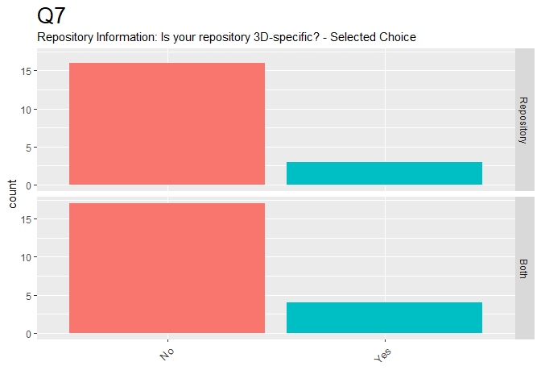
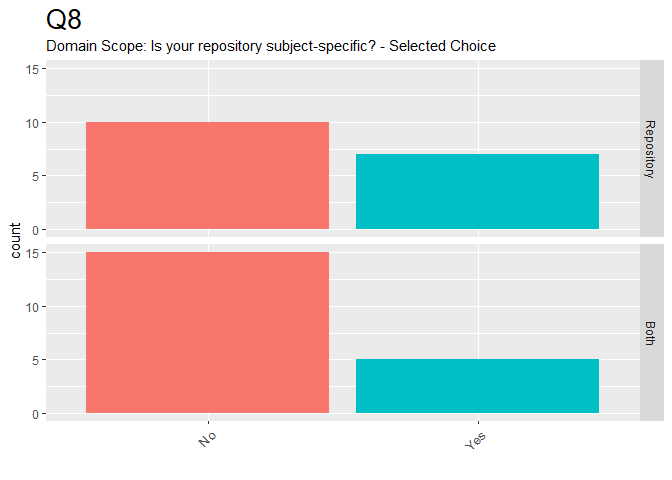
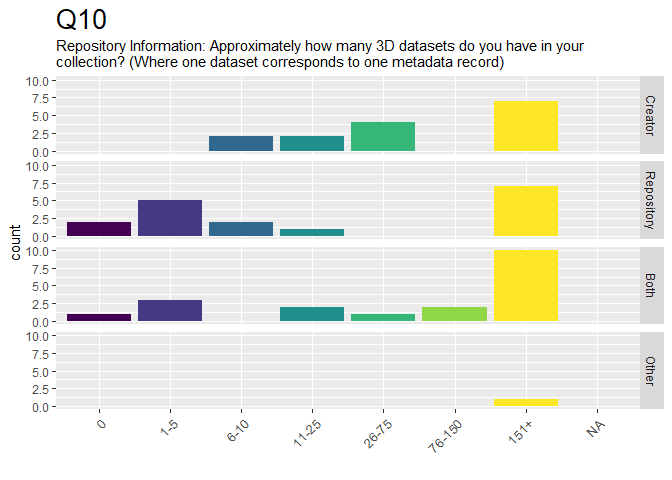
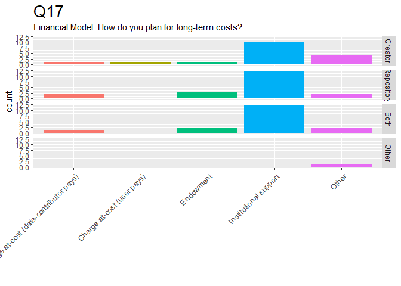

CS3DP Management Survey
================

Summary of Results
------------------

These are quick summaries of the initial results to the CS3DP Data Management survey.

1.  Raw response data is in the [CS3DP Management group folder](https://drive.google.com/drive/u/0/folders/1fc-wqiG6J3lPyPC7WoWyV0GP1bJ6A2BQ)
2.  Intermediate step:
    -   Opened data from the first sheet in Open Office/CSV-editor of choice:
    -   Selected all and un-merged cells
    -   Made sure column headers & values were aligned
    -   Appended "\_unmerged.csv" to filename
3.  Data is prepped and this doc is generated by [this RMarkdown script](https://github.com/magpiedin/CS3DP-management-survey/blob/master/CS3DP_mgmt.Rmd)

-   [Tables](#Tables)
-   [Charts](#Charts)

Tables
------

### Q1

-   What kind of 3D data do you produce or host? \*

| Group      | 3D Laser | Born-digital | CT Scanning | Lidar scanning | Other | Photogrammetry | Structured Light |
|:-----------|:---------|:-------------|:------------|:---------------|:------|:---------------|:-----------------|
| Creator    | 5        | 2            | 3           | 4              | 1     | 10             | 4                |
| Repository | 2        | 7            | 2           | 1              | 2     | 3              | 1                |
| Both       | 5        | 5            | 5           | 3              | 1     | 13             | 6                |
| Other      | 1        |              |             | 1              | 1     | 1              | 1                |

### Q4

-   Repository Institution Type: What type of institution houses/maintains the repository? \*

| Group      | 4   | Archive/Library | Commercial organization | Museum | Non-profit | Other | University department/center |
|:-----------|:----|:----------------|:------------------------|:-------|:-----------|:------|:-----------------------------|
| Repository | 2   | 5               |                         | 4      | 2          |       | 1                            |
| Both       | 1   | 7               | 1                       | 5      | 1          | 1     | 5                            |

### Q6

-   Repository Information: In what year did you or your institution begin creating, managing, and/or archiving 3D data? \*

| Group      | 2000-2004 | 2005-2009 | 2010-2014 | 2015-2019 | Before 1990 |
|:-----------|:----------|:----------|:----------|:----------|:------------|
| Creator    |           | 1         | 3         | 7         |             |
| Repository | 1         |           | 2         | 2         | 1           |
| Both       | 1         | 1         | 2         | 8         |             |
| Other      |           |           | 1         |           | 1           |

### Q7

-   Repository Information: Is your repository 3D-specific? - Selected Choice \*

| Group      | No  | Yes |
|:-----------|:----|:----|
| Repository | 7   | 2   |
| Both       | 12  | 2   |

### Q8

-   Domain Scope: Is your repository subject-specific? - Selected Choice \*

| Group      | No  | Yes |
|:-----------|:----|:----|
| Repository | 6   | 1   |
| Both       | 11  | 2   |

### Q10

-   Repository Information: Approximately how many 3D datasets do you have in your collection? (Where one dataset corresponds to one metadata record) \*

| Group      | 0   | 1 to 5 | 6 to 10 | 11 to 25 | 26-75 | 76-150 | 151+ |
|:-----------|:----|:-------|:--------|:---------|:------|:-------|:-----|
| Creator    |     |        | 2       | 2        | 3     |        | 4    |
| Repository | 2   | 1      | 2       | 1        |       |        | 2    |
| Both       | 1   | 3      |         | 1        |       | 2      | 5    |
| Other      |     |        |         |          |       |        | 1    |

### Q11

-   Access: Are these datasets shared online or through a repository? - Selected Choice \*

| Group   | No  | Some are | Yes |
|:--------|:----|:---------|:----|
| Creator | 4   | 4        | 2   |

### Q12

-   User: In what areas does your 3D data meet user needs? \*

| Group      | architectural drawings) | 3D Printing | Art | Augmented Reality | Conservation/Preservation | Education (Higher Ed.) | Education (K-12) | General Public | Other | Recreational/Hobbyist | Research | Technical Documentation (e.g. engineering | Virtual Reality |
|:-----------|:-----------------------:|:------------|:----|:------------------|:--------------------------|:-----------------------|:-----------------|:---------------|:------|:----------------------|:---------|:------------------------------------------|:----------------|
| Creator    |            2            | 2           | 4   | 3                 | 5                         | 4                      | 1                | 3              | 2     | 2                     | 9        | 2                                         | 3               |
| Repository |            1            | 2           |     |                   | 1                         | 3                      | 1                | 4              | 1     |                       | 5        | 1                                         | 3               |
| Both       |            1            | 8           | 6   | 4                 | 9                         | 8                      | 4                | 7              | 1     | 3                     | 9        | 1                                         | 6               |
| Other      |            1            | 1           |     | 1                 | 1                         | 1                      |                  | 1              |       |                       | 1        | 1                                         |                 |

### Q13

-   Cost Considerations: Does your repository charge to upload 3D data? \*

| Group      | No  | Sometimes |
|:-----------|:----|:----------|
| Repository | 8   | 1         |
| Both       | 10  | 1         |

### Q14

-   Cost Considerations: What is your pricing model? \*

| Group | Depends if we deposit with UK archaeology data service as well. They have a calculator for records. |
|:------|:----------------------------------------------------------------------------------------------------|
| Both  | 1                                                                                                   |

### Q15

-   Cost Considerations: How is your data archiving funded? \*

| Group      | Grants | Institutional Support | Other | Personal Investment/Self-funded |
|:-----------|:-------|:----------------------|:------|:--------------------------------|
| Creator    | 3      | 5                     | 1     | 4                               |
| Repository | 1      | 7                     |       |                                 |
| Both       | 3      | 10                    | 1     | 1                               |
| Other      |        |                       | 1     |                                 |

### Q16

-   Cost Considerations: How is your data creation funded? \*

| Group      | Grants | Institutional Support | Other | Personal Investment/Self-funded |
|:-----------|:-------|:----------------------|:------|:--------------------------------|
| Creator    | 6      | 8                     |       | 1                               |
| Repository | 3      | 5                     |       |                                 |
| Both       | 7      | 8                     | 2     | 1                               |
| Other      | 1      |                       |       | 1                               |

Charts
------

