CS3DP Management Survey
================

Summary of Results
------------------

These are raw/quick summaries of the initial results to the CS3DP Data Management survey.

-   Raw response data is in the [CS3DP Management group folder](https://drive.google.com/drive/u/0/folders/1fc-wqiG6J3lPyPC7WoWyV0GP1bJ6A2BQ)
-   R-Scripts to generate or edit this doc are in [this github repo](https://github.com/magpiedin/CS3DP-management-survey)

    Charts
    ------

    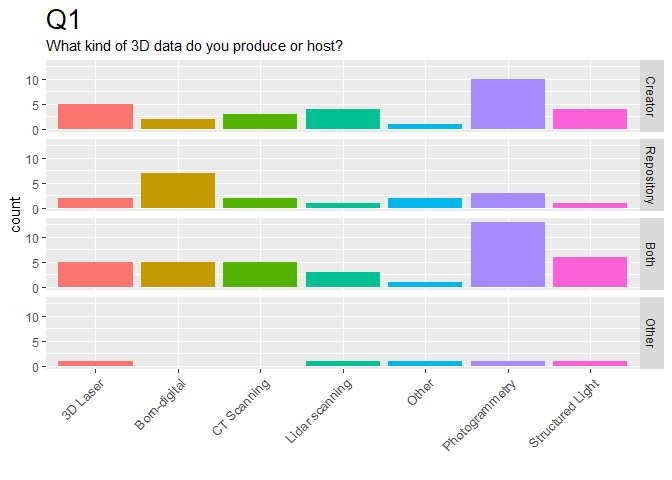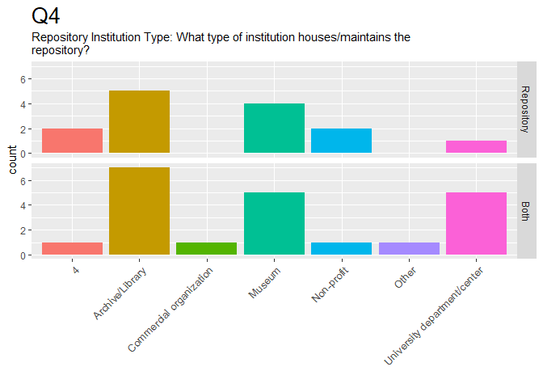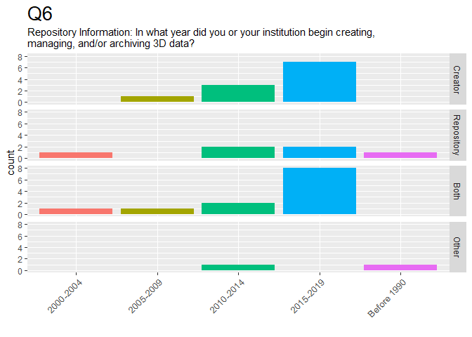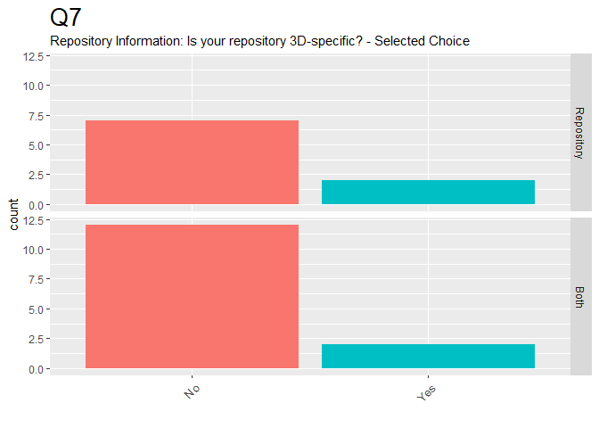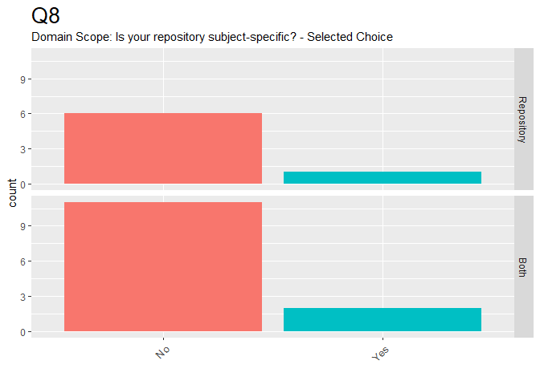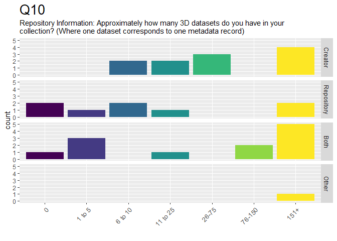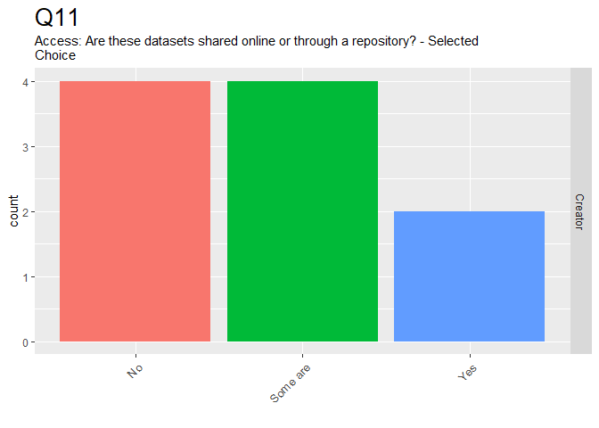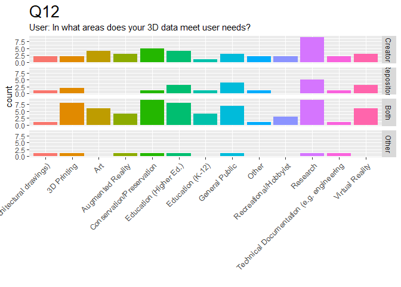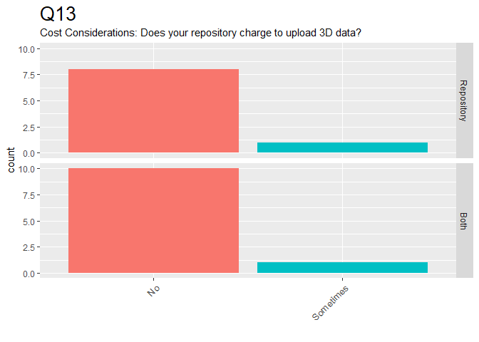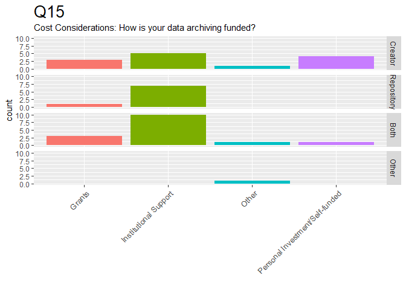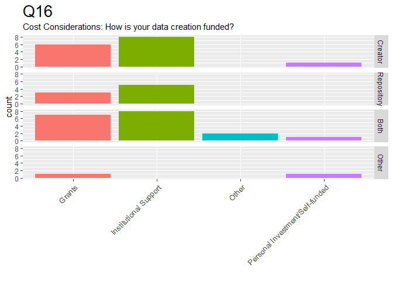
